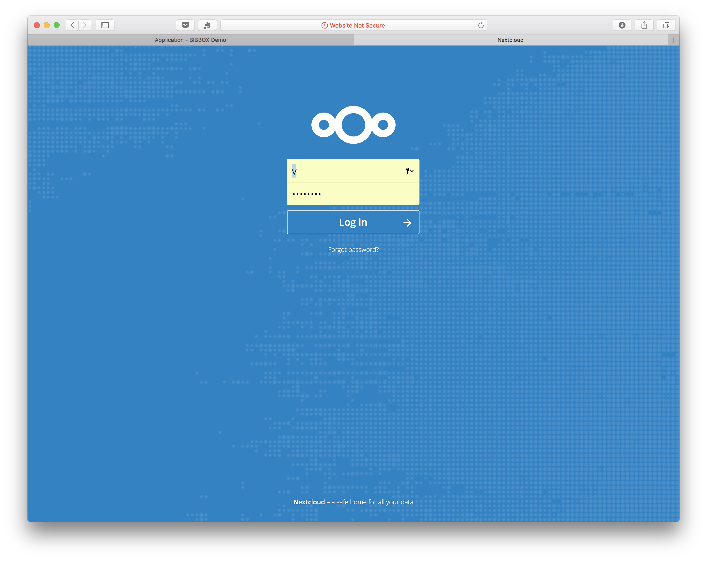
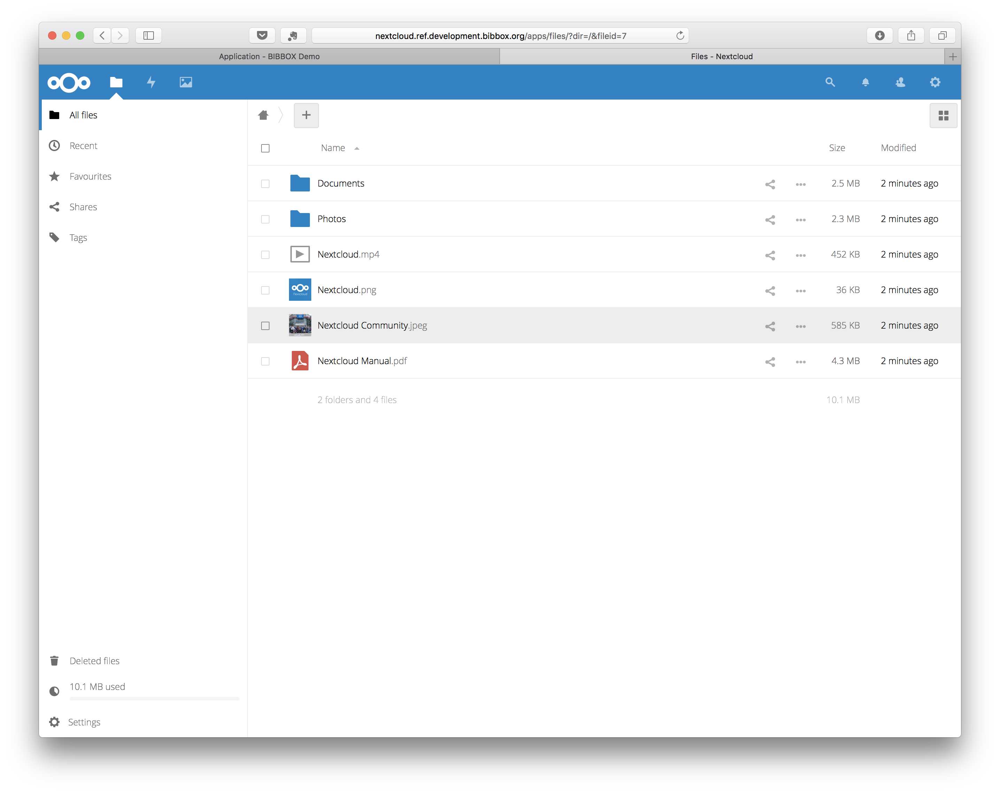
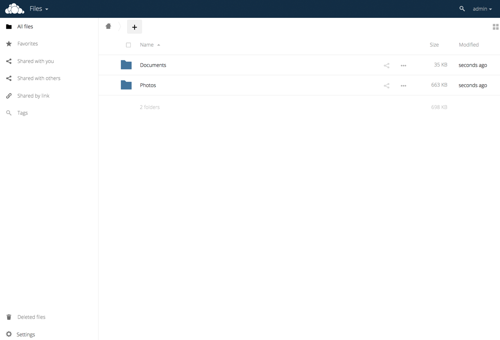

## Quick Notes

Database information is as follows:

```
Database user:      nextloud
Database password:  <yourPassword> (Default: changethispasswordinproductionenvironments) 
Database name:      nextloud
Database host:      nextloud-db
```


## NextCloud Installation Instructions 

* As soon as NetCloud has been installed within the BIBBOX, you can launch it from the Applications menu.

* A new Tab will open in your browser and show you OwnCloud's setup page. In order to finish this setup process, we need to enter our database configuration. You can do this by clicking on **Storage & database**.



* This BIBBOX application already comes with an up and running Maria DB database. So all you need to do is enter a OwnCloud **username** and **password** for your administrator account and enter the following information under the **MySQL/MariaDB** tab of the database configuration area:

        Database user:      nextcloud
        Database password:  <yourPassword> (Default: changethispasswordinproductionenvironments) 
        Database name:      nextcloud
        Database host:      nextcloud-db
        
    After entering this information, go ahead and click the **Finish setup** button.



* That's it! Your new NextCloud is now fully configured and ready to store and sync some data!




## Backup instructions

* Backup the database App directory, replace APPID with the id (subdomain) of the installed app. 

        /opt/bibbox/application-instance/APPID-app-nextcloud
        
* Backup the data directory 
    
        /opt/bibbox/application-instance/APPID-app-nextcloud/data
        
* Backup the Maria DB database with the command
       
       docker exec  APPID-nextcloud-db /usr/bin/mysqldump -u root --password='YOURROOTPASSWORD' nextcloud > /home/vmadmin/nextcloudbackup.sql

   if you forgot the database root password, you can lookup it in the docker-compose file. 
   
        /opt/bibbox/application-instance/APPID-app-nextcloud/docker-compose.yml


## After the installation

Have a nice ride with the new Admins youngtimer.


